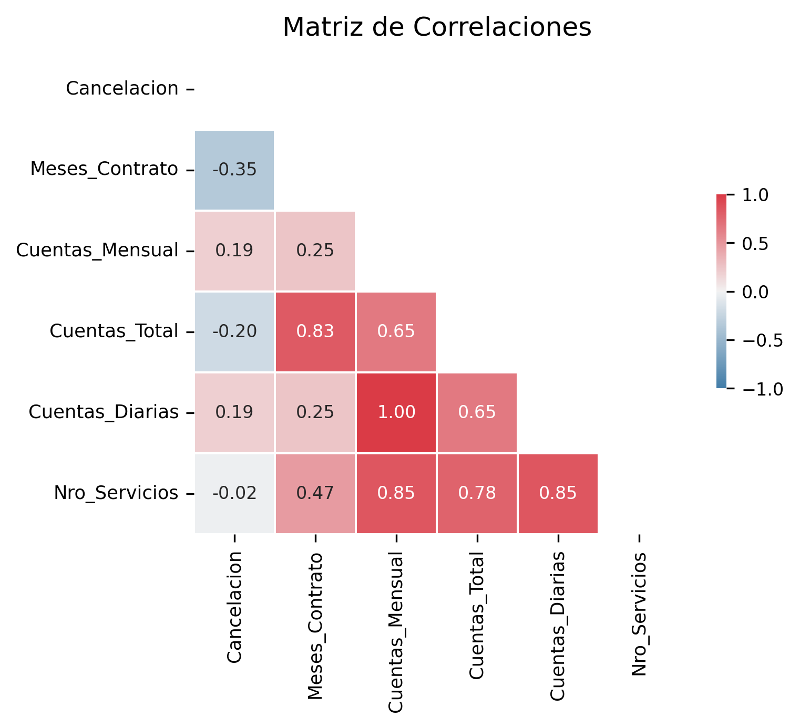

# Challenge Telecom X Parte 2
### **DESCRIPCIÓN DEL PROYECTO**
La empresa de telecomunicaciones Telecom X enfrenta una alta tasa de cancelación de clientes, y necesita comprender los factores que llevan a esto.

El objetivo es identificar que factores impulsan la cancelación y anticipar este comportamiento a través de modelos predictivos.
<br/><br/>
### **ESTRUCTURA DEL PROYECTO**
+ Extracción y Preparación de datos
+ Análisis y Selección de variables
+ Modelamiento Predictivo
+ Evaluación de Modelos
+ Informe Final

> [!NOTE]
> La interpretación de resultados y conclusiones se encuentran en el informe final.

> [!NOTE]
> El informe final se encuentra dentro del archivo *ipynb*.

<br/>

### **ORGANIZACIÓN DEL REPOSITORIO**
En la raíz se encuentran los siguientes archivos:
+ **Readme:** contiene un resumen del proyecto.
+ **TelecomX_2:** contiene el código del proyecto en formato CSV.
+ **TelecomX_Data_Depurada:** contiene la base de datos del proyecto.

Y las siguientes carpetas:
+ **img:** contiene imágenes con los análisis realizados en el proyecto

<br/>

### **PROCESO DE PREPARACIÓN DE DATOS**
#### CODIFICACIÓN
Los modelos de Machine Learning escogidos para clasificar son *K Nearest Neighbors* (KNN) y *Random Forest*. Se realizaron dos tipos de transformaciones:<br/>
- **Variables categoricas:**<br/>
  Son transformadas a variables *dummy* (binarias). Se utiliza el algoritmo de *One hot encoding*.
  ```python
  # ONE HOT ENCODING VARIABLES CATEGORICAS
  cols = X.columns
  cols_cat = ['Tipo_Contrato', 'Metodo_Pago', 'Servicio_Internet']
  
  one_hot = make_column_transformer((OneHotEncoder(drop='if_binary'), cols_cat),
                                    remainder='passthrough',
                                    sparse_threshold=0,
                                    force_int_remainder_cols=False)
  
  X = one_hot.fit_transform(X)
  ```
  <br/>
- **Variables numéricas:**<br/>
  Son transformadas a una escala común (normalizadas) para evitar sesgos por diferencia de escala. Se utilizó el método MIN-MAX ya que los datos no tienen distribución normal y deseamos tener un rango definido (de 0 a 1).<br/><br/>
  Aplica para el modelo KNN que utiliza distancias.
  ```python
  # NORMALIZACION PARA VARIABLES NUMERICAS
  norm = MinMaxScaler()
  ```

<br/>

#### SEPARACIÓN DEL CONJUNTO DE DATOS
Se utilizó el método HOLD OUT para separar el conjunto de datos en Train (70%) y Test (30%). Esto nos permite probar el modelo en un conjunto no visto y así validar su capacidad de predicción.

<br/>

#### VALIDACIÓN
Para la validación del modelo se utilizó la validación cruzada con balanceo de datos y *pipeline* para automatizar el proceso. Esto debido a que la variable objetivo sólo está representada en un 26%.<br/><br/>

Para la validación cruzada se utilizó el método *K-Fold* estratificado, esto para mantener la proporción de la variable objetivo en cada grupo.<br/><br/>

La métrica escogida para evaluar el modelo fue la **sensibilidad**: si el objetivo es reducir la cancelación de clientes, entonces se debe optimizar el error de tipo 2 (clientes previstos como no cancelados que en realidad son cancelados).<br/><br/>
Se utilizó un **intervalo de confianza** para asegurar que no haya *overfitting*. Esto nos permite revisar los resultados del score de sensibilidad en cada uno de los *K-folds*. 

<br/>

### **GRAFICOS E INSIGHTS**
Correlación de variables numéricas con la variable objetivo. Se encuentra que:
- La cancelación tiene correlación moderada positiva con Meses de contrato y Cuentas total, y negativa con Cuentas mensual y Cuentas diarias.
- La cancelación tiene casi nula correlación con Número de servicios.
- Cuentas mensual está perfectamente correlacionado con Cuentas diarias.
- Existe una alta correlación de Número de servicios con Cuentas total, Mensual y diarias.

```python
cols = ['Cancelacion', 'Meses_Contrato', 'Cuentas_Mensual', 'Cuentas_Total', 'Cuentas_Diarias', 'Nro_Servicios']
matriz_correlacion(df, cols)
plt.show()
```


<br/>

### INSTRUCCIONES DE EJECUCIÓN
El proyecto fue desarrollado en *Python* para ejecutarse en un entorno de *Google Colab*. El código está dividido en secciones que a su vez se dividen en bloques que siguen un orden secuencial de ejecución.<br/><br/>
**Tecnologías utilizadas**<br/><br/>
&nbsp;
&nbsp;


**Bibliotecas utilizadas**<br/><br/>
&nbsp;
&nbsp;
&nbsp;
&nbsp;
&nbsp;
&nbsp;
<br/><br/>

