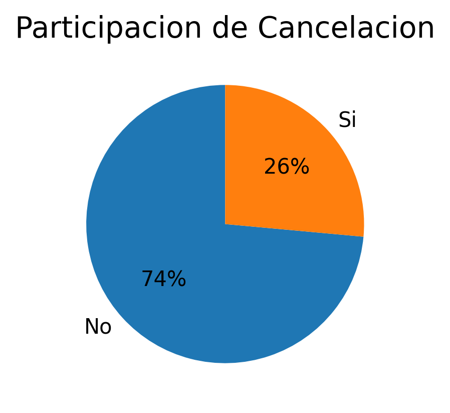

# Challenge Telecom X Parte 2
#### **DESCRIPCIÓN DEL PROYECTO**
La empresa de telecomunicaciones Telecom X enfrenta una alta tasa de cancelación de clientes, y necesita comprender los factores que llevan a esto.

El objetivo es identificar que factores impulsan la cancelación y anticipar este comportamiento a través de modelos predictivos.
<br/><br/>
#### **ESTRUCTURA DEL PROYECTO**
+ Extracción y Preparación de datos
+ Análisis y Selección de variables
+ Modelamiento Predictivo
+ Evaluación de Modelos
+ Interpretación de resultados
+ Conclusiones<br/><br/>

#### **ORGANIZACIÓN DEL REPOSITORIO**
En la raíz se encuentran los siguientes archivos:
+ **README:** contiene un resumen del proyecto
+ **TelecomX_2:** contiene el código del proyecto
+ **TelecomX_Data_Depurada:** contiene la base de datos del proyecto

Las siguientes carpetas:
+ **img:** contiene imágenes con los análisis realizados en el proyecto<br/><br/>

#### INSTRUCCIONES DE EJECUCIÓN
El proyecto fue desarrollado en *Python* para ejecutarse en un entorno de *Google Colab*. El código está dividido en secciones que a su vez se dividen en bloques que siguen un orden secuencial de ejecución.<br/><br/>
**Tecnologías utilizadas**<br/><br/>
&nbsp;
&nbsp;


**Bibliotecas utilizadas**<br/><br/>
&nbsp;
&nbsp;
&nbsp;
&nbsp;
&nbsp;
&nbsp;
<br/><br/>
#### EJEMPLO DE INSIGHT (TODO)
Participación de variable objetivo (Churn): 26% fuga, 74% permanece.
<br/>
```python
plt.figure(figsize=(4, 3))
plt.pie(df['Churn'].value_counts(), labels=['No','Si'], autopct='%1.0f%%', startangle=90)
plt.title('Participacion de Churn', fontsize=14)
plt.show()
```

<br/>

> [!NOTE]
> El informe final se encuentra dentro del archivo *ipynb*.
